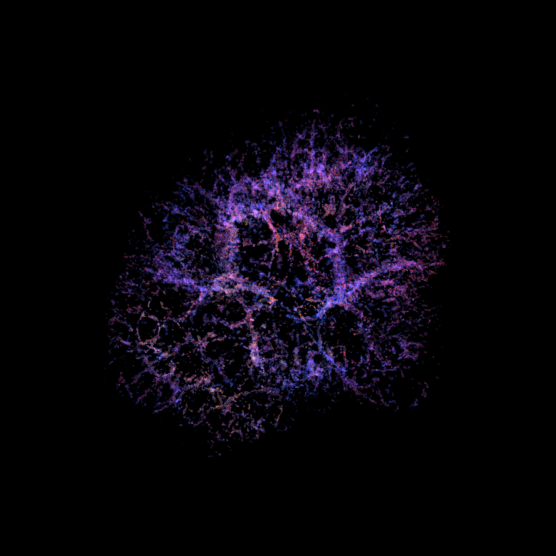
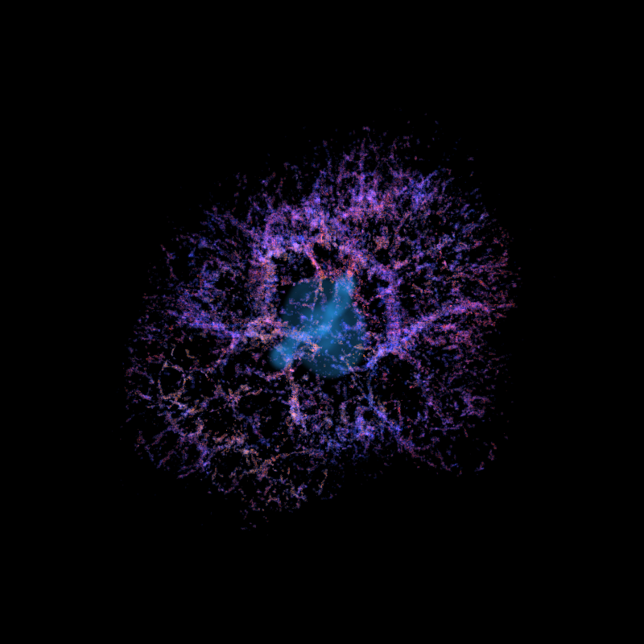
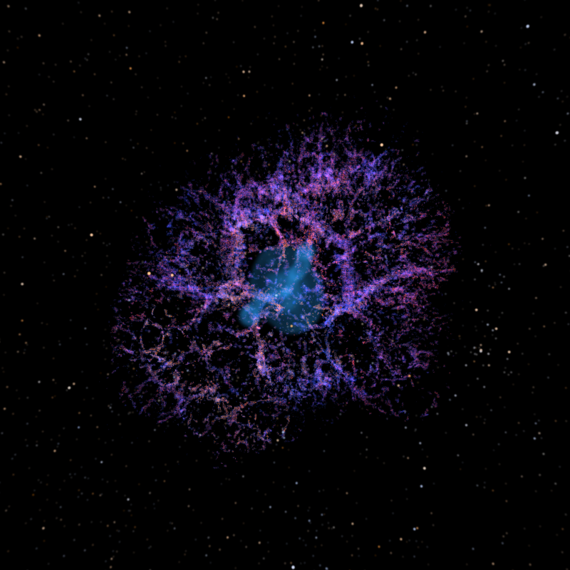

# Crab Nebula Volumetric Renderer
Physically-based volumetric rendering of the Crab Nebula from real astronomical data.
This project implements a custom volumetric renderer capable of reconstructing and rendering the Crab Nebula directly from observational spectroscopic datasets using ray marching and physically-based emission models.
Developed for the course **DH2323 — Computer Graphics** at KTH Royal Institute of Technology.

---

## Features

| Feature | Status |
|---|---|
| Volumetric ray marcher | ✅ |
| Color mapping | ✅ |
| Background star integration (Gaia DR3) | ✅ |
| Synchrotron emission rendering | ✅ |
| NanoVDB sparse renderer | ✅ |
| Camera orbit animation | ✅ |

---

## Results

### Nebula without stars
The first stage renders only the thermal filament structure reconstructed from the observational data.
<p align="center">
  
</p>

---

### Nebula with synchrotron emission
The synchrotron component of the pulsar wind nebula is rendered separately and integrated as an independent emission channel.
<p align="center">
  
</p>

---

### Nebula with stars
Background stars from the Gaia DR3 catalogue are projected into world space and composited after volume integration.
<p align="center">
  
</p>

---

## Rotating Animations

### Rotation without synchrotron
<p align="center">
  
</p>

---

### Rotation with synchrotron
<p align="center">
  
</p>

---
### Requirements
> **Suggestion for Windows users:** install [WSL2](https://learn.microsoft.com/en-us/windows/wsl/install) and follow all instructions below as on Linux.

### System requirements
- **Python** ≥ 3.9
- **C++17** compiler (g++ ≥ 11 recommended)
- **ffmpeg** — required to assemble animated GIFs at the end of Step 2
Install ffmpeg:
 
```bash
# macOS
brew install ffmpeg
 
# Linux (Ubuntu/Debian)
sudo apt install ffmpeg
```
 
---

### Python dependencies (Step 1)
 
```bash
pip install numpy astropy trimesh scipy noise
```
 
To save in NanoVDB format, OpenVDB must also be installed:
 
**macOS (Homebrew):**
```bash
brew install openvdb
pip install pyopenvdb
```
 
**Linux (Ubuntu/Debian):**
```bash
sudo apt install libopenvdb-dev
pip install pyopenvdb
```
 
> **Note:** `step1_voxelize_fits.py` and `step1_voxelize_synch.py` both import from `step1_common_fun.py`. Make sure all three files are in the same directory before running Step 1.
 
---

### C++ dependencies (Step 2)
 
Compiles as C++17 with OpenMP. NanoVDB is included with OpenVDB (no separate install needed).

macOS:
```bash
brew install gcc libomp openvdb
```

Linux:
```bash
sudo apt install g++ libomp-dev libopenvdb-dev
```

---

## Data Download
 
Before starting the rendering, downloads all necessary files and put them in `input_data/`.
 
| File | Source | Note |
|---|---|---|
| `3dmap_XYZ*.fits` | [thomasorb/M1_paper](https://github.com/thomasorb/M1_paper/tree/master) | All the `.fits` files from the repository |
| `crabNebula.obj` | [Chandra — Crab X-Ray 3D model](https://chandra.harvard.edu/deadstar/crab.html) | Download the file "Crab X-Ray 3D model" (OBJ) |
| `gaia_stars.csv` | [Gaia DR3](https://gea.esac.esa.int/archive/) | Query ADQL in the section below |
 
**Query Gaia DR3** — execute in the [Gaia ESA Archive](https://gea.esac.esa.int/archive/) to generate `gaia_stars.csv`:
 
```sql
SELECT source_id, ra, dec, phot_g_mean_mag, bp_rp
FROM gaiadr3.gaia_source
WHERE phot_g_mean_mag < 7
ORDER BY phot_g_mean_mag ASC;
```
 
Download the result in CSV format and rename it with `gaia_stars.csv`. Place it in `input_data/`.

## Project Structure
 
Before running anything, the repository expects (and produces) the following layout:
 
```
.
├── input_data/
│   ├── 3dmap_XYZflux.fits
│   ├── 3dmap_XYZnii_ha.fits
│   ├── 3dmap_XYZsii_ha.fits
│   ├── 3dmap_XYZsii_sii.fits
│   ├── 3dmap_XYZvel.fits
│   ├── crabNebula.obj
│   └── gaia_stars.csv
├── output/
│   ├── bin_512/          ← generated by Step 1
│   └── nvdb_512/         ← generated by Step 1
├── nebula_bin/           ← generated by Step 2 (binary version)
│   └── anim.gif
├── nebula_nvdb/          ← generated by Step 2 (NanoVDB version)
│   └── anim.gif
├── step1_voxelize_fits.py
├── step1_voxelize_synch.py
├── step1_common_fun.py       ← shared utilities
├── step2_common.h
├── step2_main_bin.cpp
└── step2_main_nvdb.cpp
```
 
---

### Step 1 — Voxelization

Put the files `.fits` and the mesh `crabNebula.obj` in the directory `input_data/`.

```bash
python step1_voxelize_fits.py --fits-dir input_data --output-dir output --resolution 512

python step1_voxelize_synch.py --obj input_data/crabNebula.obj --output-dir output --resolution 512
```

The output is saved in:
- `output/bin_512/` — binary raw grids 
- `output/nvdb_512/` — NanoVDB grids 

---

### Step 2 — Rendering

Choose the **binary** (more easy to compile) o **NanoVDB** (empty-space skipping, faster on sparse grids) version.

> **Note:** `gaia_stars.csv` must be present in `input_data/` before rendering. Both renderers load it from `input_data/gaia_stars.csv`.

### Binary version
 
**Compile:**
 
```bash
# macOS
g++-15 -fopenmp -std=c++17 step2_main_bin.cpp -o step2_main_bin
 
# Linux
g++ -fopenmp -std=c++17 step2_main_bin.cpp -o step2_main_bin
```
 
**Run:**
 
```bash
./step2_main_bin                              # 10 frames (default)
./step2_main_bin --frames 24                  # 24 frames
./step2_main_bin -f 1                         # single frame, no GIF
./step2_main_bin --bin-dir output/bin_256     # different resolution
```
 
---

### NanoVDB version
 
**Compile:**
 
```bash
# macOS
g++-15 -fopenmp -std=c++17 -O3 -march=native \
    -I/opt/homebrew/Cellar/openvdb/13.0.0_1/include \
    step2_main_nvdb.cpp -o step2_main_nvdb
 
# Linux
g++ -fopenmp -std=c++17 -O3 -march=native \
    -I/usr/include/openvdb \
    step2_main_nvdb.cpp -o step2_main_nvdb
```
 
> **Note (macOS):** The OpenVDB include path depends on the version installed by Homebrew. Check the correct path with:
> ```bash
> brew --prefix openvdb
> ```
> Then replace `/opt/homebrew/Cellar/openvdb/13.0.0_1` with the output of that command.
 
**Run:**
 
```bash
./step2_main_nvdb                              # 10 frames (default)
./step2_main_nvdb --frames 24                  # 24 frames
./step2_main_nvdb -f 1                         # single frame, no GIF
./step2_main_nvdb --nvdb-dir output/nvdb_256   # different resolution
```
 
Frames (PPM) and the animated GIF are saved in `nebula_bin/` or `nebula_nvdb/` respectively.

---

## Technologies

### Languages
- C++
- Python

### Libraries
- NanoVDB / OpenVDB
- NumPy
- SciPy
- Astropy
- trimesh
- noise
- ffmpeg (GIF assembly)

---

## Data Sources
- SITELLE spectroscopic reconstruction of the Crab Nebula (Martin et al. 2021)
- Gaia DR3 star catalogue
- NASA/Chandra Crab Nebula 3D mesh

---

## Documentation
 
| Document | Link |
|---|---|
| Initial Project Specification | [project_specification](documentation/Project_specification_SAVO_STEFANUTTI.pdf) |
| Final Project Report | [project_report](documentation/Project_Report_SAVO_STEFANUTTI.pdf) |
 

---

## Authors
- Giorgia Savo
- Francesco Filippo Stefanutti
