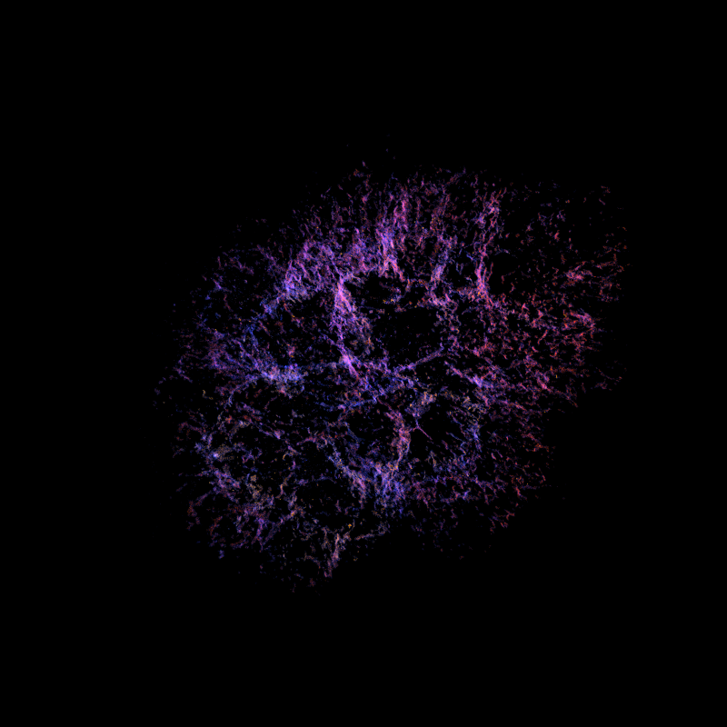
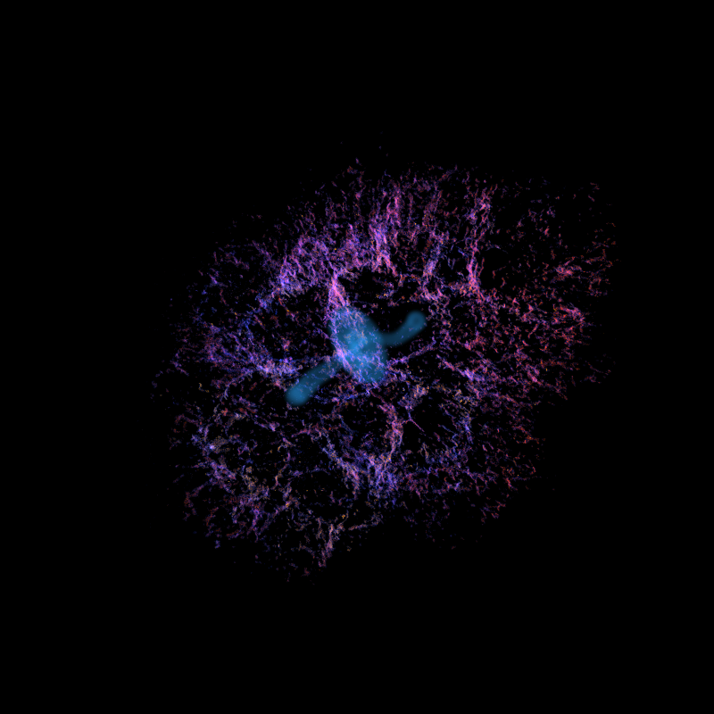
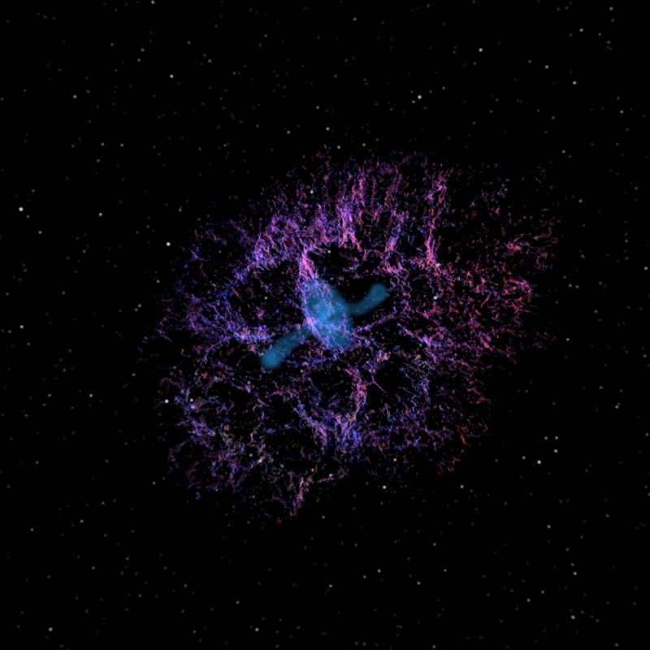

# Crab Nebula Volumetric Renderer

Physically-based volumetric rendering of the Crab Nebula from real astronomical data.

This project implements a custom volumetric renderer capable of reconstructing and rendering the Crab Nebula directly from observational spectroscopic datasets using ray marching and physically-based emission models.

Developed for the course **DH2323 — Computer Graphics** at KTH Royal Institute of Technology.

---

## Features

| Feature | Status |
|---|---|
| Volumetric ray marcher | ✅ |
| Color mapping | ✅ |
| Background star integration (Gaia DR3) | ✅ |
| Synchrotron emission rendering | ✅ |
| NanoVDB sparse renderer | ✅ |
| Camera orbit animation | ✅ |

---

## Results

### Nebula without stars

The first stage renders only the thermal filament structure reconstructed from the observational data.

  

---

### Nebula with synchrotron emission

The synchrotron component of the pulsar wind nebula is rendered separately and integrated as an independent emission channel.

  

---

### Nebula with stars

Background stars from the Gaia DR3 catalogue are projected into world space and composited after volume integration.

  

---

## Rotating Animations

### Rotation without synchrotron

  

---

### Rotation with synchrotron

  

---

## Technologies

### Languages
- C++
- Python

### Libraries
- NanoVDB
- OpenVDB
- NumPy
- SciPy
- trimesh
- noise

---

## Data Sources

- SITELLE spectroscopic reconstruction of the Crab Nebula
- Gaia DR3 star catalogue
- NASA Crab Nebula 3D mesh

---

## Authors

- Giorgia Savo
- Francesco Filippo Stefanutti
